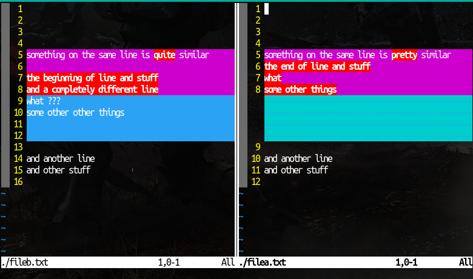
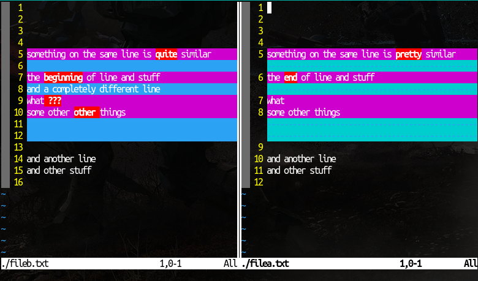
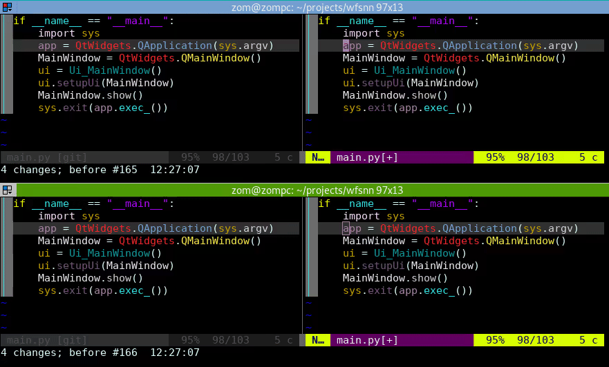
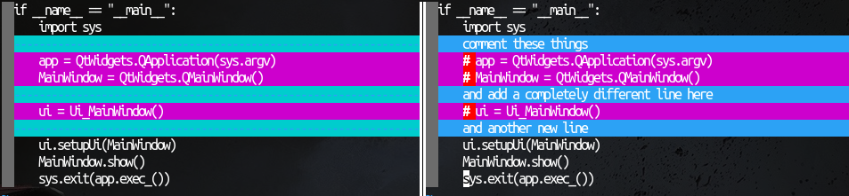

## linematch diff mode: Improved Diff Mode Fork for neovim

This fork was created to improve the diff mode of neovim to show more useful
information when comparing lines between files in diff view. Line comparisons
are made in a more useful way to show which lines are actually being added,
changed, and deleted.

## Before:
  

## After:
  

## In action:
  

## How to use:
enable this enhanced diff mode by using :set diffopt+=linematch. The line match
diff opt is disabled automatically when diffing more than two files at once.

## Why is this not a plugin?
This may be able to be converted to a plugin, but doing so would take much more
work because the original diff mode would first need to be completely hidden.
All the locations with diffs would need to be overwritten with the text from the
linematch diff output. This would include writing text over locations which are
marked as filler lines, which I don't believe is possible to do. Changing lines
would need to be done on different "fake lines", because part of the
functionality here moves around the lines to align them between the diff
buffers.
Additionally, By default the diff mode in vim is
very bad compared to other editors like Emacs and vs-code, so by default VIM
should have a comparable high quality diff view because other editors do.

## How it works:
An algorithm is implemented to attempt to compare the most similar lines in each
buffer, rather than only the side by side lines, as is the default diff mode
behavior. A two dimensional array is populated for each diff block. The array
is used to store the respective line numbers and show which line number in the
other buffer they should be compared to. As the line match diff mode currently
only works for two buffers, the array is populated twice, once to compare buffer
1 to buffer 2, and once to compare buffer 2 to buffer 1.

  

Buffer 1 (left)
This line | Most similar line in other buffer
------------- | -------------
app = QtWidgets.QApplication(sys.argv) |  # app = QtWidgets.QApplication(sys.argv)
MainWindow = QtWidgets.QMainWindow() | # MainWindow = QtWidgets.QMainWindow()
ui = Ui\_MainWindow() | # ui = Ui\_MainWindow()

Buffer 2 (right)
This line | Most similar line in other buffer
------------- | -------------
comment these things | ui = Ui\_MainWindow()
\# app = QtWidgets.QApplication(sys.argv) | NONE
\# MainWindow = QtWidgets.QMainWindow() | NONE
and add a completely different line here | NONE
\# ui = Ui\_MainWindow() | NONE
and another new line | NONE

After the comparisons are made to reach respective buffer, the preferred diff
buffer is chosen as the buffer which, when compared to the other, had the least
amount of skipped lines. In the tables shown above, 'comment these things' is
matched to Ui\_MainWindow() because the levenstein distance is the shortest.

The code which performs this function can be found in diff.c

```
    for(i=0;i<DB_COUNT;++i){
      for(int j=0;j<DB_COUNT;++j){ // i and j represent the comparison buffers, they are each compared with each other
	if((curtab->tp_diffbuf[i]!=NULL)&&(curtab->tp_diffbuf[j]!=NULL)&&(i!=j)){
	  char_u* lineoriginal;
	  char_u* linenew;
	  int skipped=0; // we keep track of how many lines have been skipped in this comparison
	  int comparisonline=dp->df_lnum[j];
	  for(int k=0;k<dp->df_count[i];k++){
	    int thislinenumber=dp->df_lnum[i]+k; // the current line number in this diff block
	    lineoriginal=ml_get_buf(curtab->tp_diffbuf[i],thislinenumber,false);
	    dp->df_comparisonlines[i][j].mem[k]=-1; // initialize to -1 // which line are we comparing in the other buffer? default -1 for none
	    int lowestscore=INT_MAX;
	    if(comparisonline<dp->df_lnum[j]+dp->df_count[j]){
	      int d_skipped=0;
	      int comparisonlinestart=comparisonline;
	      for(int cl=comparisonline;cl<dp->df_lnum[j]+dp->df_count[j];cl++){
		linenew=ml_get_buf(curtab->tp_diffbuf[j],cl,false);
		int score=levenshtein(lineoriginal,linenew); // calculate the levenstein distance
		if(score<lowestscore){
		  dp->df_comparisonlines[i][j].mem[k]=cl;
		  lowestscore=score;
		  d_skipped=(cl-comparisonlinestart);
		  comparisonline=cl+1; // start the next comparison after this line only, so we cant compare a line that was above this
		}
	      }
	      skipped+=d_skipped; // keep track of how many lines have been skipped to calculate the preferred diff buffer later
	    }else skipped++;
	  }
	  if(dp->df_max_skipped[i]<skipped){
	    dp->df_max_skipped[i]=skipped;
	  }
	}
      }
    }
```
When lines are skipped, an index is updated, such that one a line will always be
compared to a line below the current comparison line index, never above it


for discussion about this fork, see this
[reddit post:](https://www.reddit.com/r/vim/comments/mkoaj8/an_improved_diff_mode_for_vim/)


## original neovim documentation:

[](https://neovim.io)

[Documentation](https://neovim.io/doc) |
[Chat](https://gitter.im/neovim/neovim) |
[Twitter](https://twitter.com/Neovim)

[](https://github.com/neovim/neovim/actions?query=workflow%3A%22CI%22)
[](https://codecov.io/gh/neovim/neovim)
[](https://scan.coverity.com/projects/2227)
[](https://neovim.io/doc/reports/clang)
[](https://neovim.io/doc/reports/pvs/PVS-studio.html.d)

[](https://repology.org/metapackage/neovim)
[](https://buildd.debian.org/neovim)
[](https://github.com/neovim/neovim/releases/)
[](https://snapcraft.io/nvim)

Neovim is a project that seeks to aggressively refactor Vim in order to:

- Simplify maintenance and encourage [contributions](CONTRIBUTING.md)
- Split the work between multiple developers
- Enable [advanced UIs] without modifications to the core
- Maximize [extensibility](https://github.com/neovim/neovim/wiki/Plugin-UI-architecture)

See the [Introduction](https://github.com/neovim/neovim/wiki/Introduction) wiki page and [Roadmap]
for more information.

Features
--------

- Modern [GUIs](https://github.com/neovim/neovim/wiki/Related-projects#gui)
- [API access](https://github.com/neovim/neovim/wiki/Related-projects#api-clients)
  from any language including C/C++, C#, Clojure, D, Elixir, Go, Haskell, Java,
  JavaScript/Node.js, Julia, Lisp, Lua, Perl, Python, Racket, Ruby, Rust
- Embedded, scriptable [terminal emulator](https://neovim.io/doc/user/nvim_terminal_emulator.html)
- Asynchronous [job control](https://github.com/neovim/neovim/pull/2247)
- [Shared data (shada)](https://github.com/neovim/neovim/pull/2506) among multiple editor instances
- [XDG base directories](https://github.com/neovim/neovim/pull/3470) support
- Compatible with most Vim plugins, including Ruby and Python plugins

See [`:help nvim-features`][nvim-features] for the full list!

Install from package
--------------------

Pre-built packages for Windows, macOS, and Linux are found on the
[Releases](https://github.com/neovim/neovim/releases/) page.

[Managed packages] are in [Homebrew], [Debian], [Ubuntu], [Fedora], [Arch Linux],
[Gentoo], and more!

Install from source
-------------------

The build is CMake-based, but a Makefile is provided as a convenience.

    make CMAKE_BUILD_TYPE=RelWithDebInfo
    sudo make install

To install to a non-default location:

    make CMAKE_INSTALL_PREFIX=/full/path/
    make install

To skip bundled (`third-party/*`) dependencies:

1. Install the dependencies using a package manager.
   ```
   sudo apt install gperf luajit luarocks libuv1-dev libluajit-5.1-dev libunibilium-dev libmsgpack-dev libtermkey-dev libvterm-dev libutf8proc-dev
   sudo luarocks build mpack
   sudo luarocks build lpeg
   sudo luarocks build inspect
   ```
2. Build with `USE_BUNDLED=OFF`:
   ```
   make CMAKE_BUILD_TYPE=RelWithDebInfo USE_BUNDLED=OFF
   sudo make install
   ```

To inspect the build, these CMake features are useful:

- `cmake --build build --target help` lists all build targets.
- `build/CMakeCache.txt` (or `cmake -LAH build/`) contains the resolved values of all CMake variables.
- `build/compile_commands.json` shows the full compiler invocations for each translation unit.

See the [Building Neovim](https://github.com/neovim/neovim/wiki/Building-Neovim) wiki page for details.

Transitioning from Vim
--------------------

See [`:help nvim-from-vim`](https://neovim.io/doc/user/nvim.html#nvim-from-vim) for instructions.

Project layout
--------------

    ├─ ci/              build automation
    ├─ cmake/           build scripts
    ├─ runtime/         user plugins/docs
    ├─ src/nvim/        application source code (see src/nvim/README.md)
    │  ├─ api/          API subsystem
    │  ├─ eval/         VimL subsystem
    │  ├─ event/        event-loop subsystem
    │  ├─ generators/   code generation (pre-compilation)
    │  ├─ lib/          generic data structures
    │  ├─ lua/          Lua subsystem
    │  ├─ msgpack_rpc/  RPC subsystem
    │  ├─ os/           low-level platform code
    │  └─ tui/          built-in UI
    ├─ third-party/     CMake subproject to build dependencies
    └─ test/            tests (see test/README.md)

License
-------

Neovim contributions since [b17d96][license-commit] are licensed under the
Apache 2.0 license, except for contributions copied from Vim (identified by the
`vim-patch` token). See LICENSE for details.

    Vim is Charityware.  You can use and copy it as much as you like, but you are
    encouraged to make a donation for needy children in Uganda.  Please see the
    kcc section of the vim docs or visit the ICCF web site, available at these URLs:

            http://iccf-holland.org/
            http://www.vim.org/iccf/
            http://www.iccf.nl/

    You can also sponsor the development of Vim.  Vim sponsors can vote for
    features.  The money goes to Uganda anyway.

[license-commit]: https://github.com/neovim/neovim/commit/b17d9691a24099c9210289f16afb1a498a89d803
[nvim-features]: https://neovim.io/doc/user/vim_diff.html#nvim-features
[Roadmap]: https://neovim.io/roadmap/
[advanced UIs]: https://github.com/neovim/neovim/wiki/Related-projects#gui
[Managed packages]: https://github.com/neovim/neovim/wiki/Installing-Neovim#install-from-package
[Debian]: https://packages.debian.org/testing/neovim
[Ubuntu]: http://packages.ubuntu.com/search?keywords=neovim
[Fedora]: https://apps.fedoraproject.org/packages/neovim
[Arch Linux]: https://www.archlinux.org/packages/?q=neovim
[Gentoo]: https://packages.gentoo.org/packages/app-editors/neovim
[Homebrew]: https://formulae.brew.sh/formula/neovim

<!-- vim: set tw=80: -->
